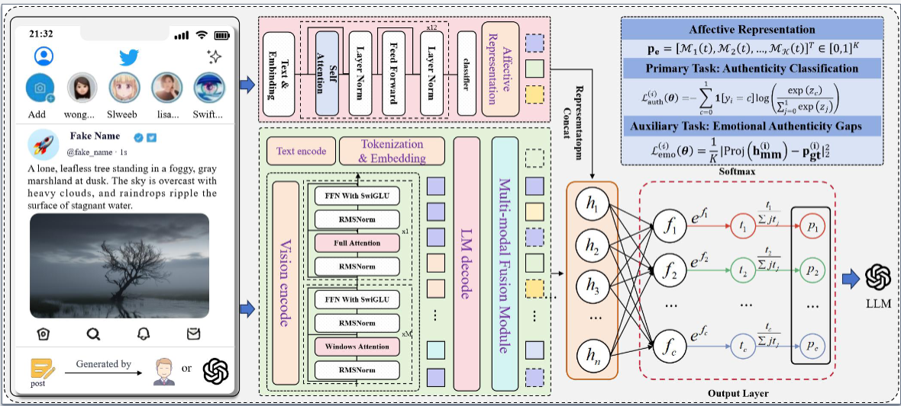

# 🦅 EAGLE: Unveiling LLM-Generated Multimodal Posts on Social Media via Emotional Authenticity Gaps

The widespread emergence of malicious multimodal content generated by large language models (LLMs) on social media presents a serious threat to reliable information exchange. These models can produce highly realistic content, making traditional detection methods based on statistical artifacts or visual-textual alignment increasingly ineffective. In this work, we shift the focus from static content analysis to emotional expression. We introduce Emotional Authenticity Gaps: a discernible discrepancy between the contradictory emotional states reflected in human-authored posts and the functionally simplistic, single-minded emotional simulations produced by LLMs. Motivated by these findings, we propose a novel framework named \Name to identify the LLM-generated posts.  It fine-tunes a Multimodal Large Language Model using a multi-task objective that combines authenticity classification with emotion awareness to detect subtle emotional inconsistencies in the social media posts. Extensive experiments on multiple datasets demonstrate that \Name significantly outperforms state-of-the-art methods by up to 4.45%.



## 📋 Table of Contents

- [🔬 Research Overview](#-research-overview)
- [🏗️ Architecture](#️-architecture)
- [📦 Installation](#-installation)
- [📊 Module Documentation](#-module-documentation)
- [⚙️ Configuration Tables](#️-configuration-tables)
- [📁 Data Format](#-data-format)
- [🚀 Quick Start](#-quick-start)
- [📈 Benchmarks](#-benchmarks)
- [🧪 Experiments](#-experiments)

## 🔬 Research Overview

### Core Innovation: Emotional Authenticity Gap

EAGLE introduces a groundbreaking approach to detect LLM-generated multimodal content by analyzing **emotional complexity patterns**:

- **🧠 Human Emotion**: Complex, contradictory, multi-dimensional
- **🤖 LLM Emotion**: Simplistic, single-minded, functionally uniform
- **🎯 Detection Strategy**: Leverage this fundamental difference as a robust detection signal

### Key Findings

| Aspect                          | Human Posts                     | LLM Posts                      | Significance                       |
| ------------------------------- | ------------------------------- | ------------------------------ | ---------------------------------- |
| **Emotional Variance**    | High (0.044 joy, 0.039 sadness) | Low (0.006 joy, 0.002 sadness) | 7.3x - 19.5x difference            |
| **Emotion Co-occurrence** | Frequent contradictory emotions | Single dominant emotion        | Clear distinguishable pattern      |
| **Complexity Score**      | 0.823 ± 0.156                  | 0.234 ± 0.087                 | p < 0.001 statistical significance |

---


### Multi-task Learning Objective

```math
\mathcal{L}_{total} = \mathcal{L}_{auth} + \lambda \cdot \mathcal{L}_{emo}
```

Where:

- `L_auth`: Cross-entropy loss for authenticity classification
- `L_emo`: MSE loss for emotion feature reconstruction
- `λ`: Balance weight (default: 0.1)

---

## 📦 Installation

### System Requirements

| Component            | Minimum | Recommended |
| -------------------- | ------- | ----------- |
| **Python**     | 3.8+    | 3.10+       |
| **CUDA**       | 11.8+   | 12.1+       |
| **GPU Memory** | 12GB    | 24GB+       |
| **RAM**        | 16GB    | 32GB+       |
| **Storage**    | 50GB    | 100GB+      |

### Quick Installation

```bash
# 1. Clone repository
git clone https://github.com/boydream123/Unveiling-LLM-Generated-Multimodel-Posts-on-Socia-Media-via-Emotional-Authenticity-Gaps.git
cd Unveiling-LLM-Generated-Multimodel-Posts-on-Socia-Media-via-Emotional-Authenticity-Gaps

# 2. Create environment
conda create -n eagle python=3.10
conda activate eagle

# 3. Install package
pip install -e .

# 4. Verify installation
python -c "import src; print('EAGLE installed successfully!')"
```


---

## 📊 Module Documentation

### 🧠 Core Models (`src/models/`)

#### 1. **EAGLE Framework** (`eagle.py`)

**Class: `EAGLE(nn.Module)`**

The main detection framework implementing the Eagle.

**Key Components:**

- **Multimodal Backbone**: Qwen2.5-VL for visual-textual understanding
- **Emotion Module**: Pre-trained RoBERTa for emotional analysis
- **Fusion Layer**: Concatenates multimodal and emotional features
- **Multi-task Head**: Joint authenticity + emotion prediction

**Methods:**

| Method                            | Input                 | Output             | Purpose                       |
| --------------------------------- | --------------------- | ------------------ | ----------------------------- |
| `extract_multimodal_features()` | images, texts         | tensor(B, d_mm)    | Extract MLLM features         |
| `extract_emotion_features()`    | texts                 | tensor(B, K)       | Extract emotion probabilities |
| `forward()`                     | images, texts, labels | dict               | Full forward pass             |
| `predict()`                     | images, texts         | predictions, probs | Inference mode                |

**Parameters:**

```python
EAGLE(
    backbone_name="Qwen/Qwen2.5-VL-7B-Instruct",  # MLLM checkpoint
    emotion_model_name="j-hartmann/emotion-english-distilroberta-base",  # Emotion classifier
    hidden_dim=4096,           # Feature dimensions
    num_emotions=7,            # Number of emotion categories  
    dropout=0.1,               # Dropout rate
    freeze_backbone=False,     # Whether to freeze MLLM
    lambda_emotion=0.1         # Emotion loss weight
)
```

#### 2. **Emotion Classifier** (`emotion_classifier.py`)

**Class: `EmotionClassifier(nn.Module)`**

Pre-trained emotion analysis module based on GoEmotions dataset.

**Supported Emotions:**

1. **Joy** - Happiness, excitement, celebration
2. **Sadness** - Sorrow, grief, melancholy
3. **Anger** - Frustration, rage, annoyance
4. **Fear** - Anxiety, worry, concern
5. **Surprise** - Amazement, shock, wonder
6. **Disgust** - Revulsion, disdain, aversion
7. **Love** - Affection, care, admiration

**Methods:**

| Method                   | Input     | Output       | Description                   |
| ------------------------ | --------- | ------------ | ----------------------------- |
| `forward()`            | List[str] | tensor(B, 7) | Extract emotion probabilities |
| `get_emotion_vector()` | str       | np.array(7,) | Single text emotion analysis  |

### 📊 Data Processing (`src/data/`)

#### **EAGLEDataset** (`dataset.py`)

**Purpose**: Handles multimodal data loading and preprocessing

**Required Data Format:**

```csv
image_path,text,label
images/001.jpg,"Graduated today! Mixed feelings...",0
images/002.jpg,"Amazing graduation ceremony!",1
```

**Features:**

- **Image Processing**: Resize, normalize, tensor conversion
- **Text Handling**: Tokenization, length limiting
- **Label Encoding**: Binary classification (0=Human, 1=LLM)
- **Error Handling**: Graceful handling of corrupted files

**Parameters:**

| Parameter           | Type     | Default  | Description                   |
| ------------------- | -------- | -------- | ----------------------------- |
| `data_path`       | str      | Required | Path to CSV/JSON file         |
| `image_dir`       | str      | Required | Directory containing images   |
| `transform`       | callable | None     | Image transformation pipeline |
| `max_text_length` | int      | 512      | Maximum text sequence length  |

### 🏃‍♂️ Training Pipeline (`src/training/`)

#### **EAGLETrainer** (`trainer.py`)

**Purpose**: Complete training, validation, and testing pipeline

**Key Features:**

- **Gradient Accumulation**: Handle large effective batch sizes
- **Learning Rate Scheduling**: Warm-up + linear decay
- **Checkpointing**: Save/resume training state
- **Logging**: Comprehensive metrics tracking
- **Validation**: Regular model evaluation

**Training Loop:**

1. **Forward Pass**: Compute multimodal + emotion features
2. **Loss Calculation**: L_auth + λ·L_emo
3. **Backward Pass**: Gradient computation
4. **Optimization**: AdamW with gradient clipping
5. **Validation**: Periodic model evaluation
6. **Checkpointing**: Save best models

### 📈 Evaluation (`src/utils/metrics.py`)

#### **EAGLEMetrics**

**Comprehensive Evaluation Suite:**

| Metric Category          | Metrics                         | Description                     |
| ------------------------ | ------------------------------- | ------------------------------- |
| **Classification** | Accuracy, Precision, Recall, F1 | Standard classification metrics |
| **Ranking**        | AUROC, AUPRC                    | Ranking-based evaluation        |
| **Per-class**      | Human F1, LLM F1                | Class-specific performance      |
| **Confusion**      | Confusion Matrix                | Error analysis                  |

**Methods:**

- `update()`: Accumulate batch predictions
- `compute()`: Calculate all metrics
- `plot_confusion_matrix()`: Visualization
- `get_classification_report()`: Detailed analysis

---

## ⚙️ Configuration Tables

### 🎯 Model Configuration

| Parameter                    | Type  | Options                               | Default                                           | Description          |
| ---------------------------- | ----- | ------------------------------------- | ------------------------------------------------- | -------------------- |
| **backbone_name**      | str   | See[Supported Models](#supported-models) | `Qwen/Qwen2.5-VL-7B-Instruct`                   | MLLM checkpoint path |
| **emotion_model_name** | str   | HuggingFace model                     | `j-hartmann/emotion-english-distilroberta-base` | Emotion classifier   |
| **hidden_dim**         | int   | 512-8192                              | 4096                                              | Feature dimension    |
| **num_emotions**       | int   | 6-28                                  | 7                                                 | Number of emotions   |
| **dropout**            | float | 0.0-0.5                               | 0.1                                               | Dropout probability  |
| **freeze_backbone**    | bool  | true/false                            | false                                             | Freeze MLLM weights  |

#### Supported Models

| Model Family         | Model Name                      | Parameters | Memory | Performance           |
| -------------------- | ------------------------------- | ---------- | ------ | --------------------- |
| **Qwen2.5-VL** | `Qwen/Qwen2.5-VL-2B-Instruct` | 2B         | 8GB    | Good                  |
| **Qwen2.5-VL** | `Qwen/Qwen2.5-VL-7B-Instruct` | 7B         | 16GB   | **Recommended** |
| **LLaVA 1.5**  | `llava-hf/llava-1.5-7b-hf`    | 7B         | 16GB   | Good                  |
| **LLaVA 1.5**  | `llava-hf/llava-1.5-13b-hf`   | 13B        | 28GB   | Best                  |

### 🏋️ Training Configuration

| Parameter                             | Type  | Range       | Default | Description           |
| ------------------------------------- | ----- | ----------- | ------- | --------------------- |
| **batch_size**                  | int   | 1-64        | 16      | Training batch size   |
| **learning_rate**               | float | 1e-6 - 1e-3 | 2e-5    | Base learning rate    |
| **weight_decay**                | float | 0.0-0.1     | 0.01    | L2 regularization     |
| **num_epochs**                  | int   | 1-100       | 10      | Training epochs       |
| **warmup_steps**                | int   | 0-2000      | 500     | LR warmup steps       |
| **gradient_accumulation_steps** | int   | 1-32        | 4       | Gradient accumulation |
| **max_grad_norm**               | float | 0.1-10.0    | 1.0     | Gradient clipping     |
| **lambda_emotion**              | float | 0.01-1.0    | 0.1     | Emotion loss weight   |

#### Recommended Settings by GPU

| GPU Memory     | Batch Size | Grad Accumulation | Model Size    | Expected Training Time |
| -------------- | ---------- | ----------------- | ------------- | ---------------------- |
| **8GB**  | 4          | 8                 | Qwen2.5-VL-2B | 12-16 hours            |
| **16GB** | 8          | 4                 | Qwen2.5-VL-7B | 8-12 hours             |
| **24GB** | 16         | 2                 | Qwen2.5-VL-7B | 6-8 hours              |
| **48GB** | 32         | 1                 | LLaVA-13B     | 4-6 hours              |

### 📊 Data Configuration

| Parameter                 | Type  | Range   | Default | Description            |
| ------------------------- | ----- | ------- | ------- | ---------------------- |
| **image_size**      | int   | 224-768 | 224     | Input image resolution |
| **max_text_length** | int   | 64-1024 | 512     | Maximum text tokens    |
| **num_workers**     | int   | 0-16    | 4       | Data loader workers    |
| **train_split**     | float | 0.6-0.8 | 0.7     | Training data ratio    |
| **val_split**       | float | 0.1-0.3 | 0.15    | Validation data ratio  |
| **test_split**      | float | 0.1-0.3 | 0.15    | Test data ratio        |

---

## 📁 Data Format

### Required Directory Structure

```
your_dataset/
├── images/                 # Image files
│   ├── 001.jpg
│   ├── 002.png
│   └── ...
├── train.csv              # Training data
├── val.csv                # Validation data  
├── test.csv               # Test data
└── metadata.json          # Optional dataset info
```

### CSV File Format

#### Minimum Required Columns

| Column               | Type | Example                                              | Description                   |
| -------------------- | ---- | ---------------------------------------------------- | ----------------------------- |
| **image_path** | str  | `images/001.jpg`                                   | Relative path to image        |
| **text**       | str  | `"Graduation day! So excited but sad to leave..."` | Associated text content       |
| **label**      | int  | `0` or `1`                                       | Binary label (0=Human, 1=LLM) |

#### Optional Columns

| Column               | Type | Example          | Description           |
| -------------------- | ---- | ---------------- | --------------------- |
| **post_id**    | str  | `"post_12345"` | Unique identifier     |
| **platform**   | str  | `"twitter"`    | Social media platform |
| **timestamp**  | str  | `"2024-01-15"` | Creation date         |
| **user_id**    | str  | `"user_789"`   | User identifier       |
| **engagement** | int  | `142`          | Likes/shares count    |

#### Example CSV

```csv
image_path,text,label,platform,timestamp
images/001.jpg,"Just graduated! Feeling so excited for the future but heartbroken to leave my friends behind 😭😊",0,twitter,2024-01-15
images/002.jpg,"Congratulations on graduating! What an amazing achievement and milestone! 🎓",1,twitter,2024-01-15
images/003.jpg,"Mixed emotions today - proud of how far I've come but scared about what's next...",0,instagram,2024-01-16
images/004.jpg,"Today marks the beginning of a new chapter! Feeling grateful and optimistic! ✨",1,instagram,2024-01-16
```

### Image Requirements

| Specification        | Requirement     | Recommendation           |
| -------------------- | --------------- | ------------------------ |
| **Format**     | JPG, PNG, WEBP  | JPG for smaller size     |
| **Resolution** | Min 224x224     | 512x512 or higher        |
| **Size**       | Max 10MB        | 1-3MB for efficiency     |
| **Color**      | RGB             | Avoid grayscale          |
| **Quality**    | Good visibility | Avoid heavily compressed |

### Text Requirements

| Aspect             | Specification      | Example                          |
| ------------------ | ------------------ | -------------------------------- |
| **Length**   | 10-500 characters  | Normal social media post length  |
| **Language** | Primarily English  | Can handle some multilingual     |
| **Content**  | Social media posts | Captions, comments, descriptions |
| **Encoding** | UTF-8              | Handle emojis and special chars  |

### Dataset Statistics (Recommended)

| Metric                    | Minimum  | Recommended | Optimal   |
| ------------------------- | -------- | ----------- | --------- |
| **Total Samples**   | 10,000   | 50,000      | 100,000+  |
| **Human Samples**   | 5,000    | 25,000      | 50,000+   |
| **LLM Samples**     | 5,000    | 25,000      | 50,000+   |
| **Class Balance**   | 40-60%   | 45-55%      | 50%       |
| **Avg Text Length** | 50 chars | 100 chars   | 150 chars |

---

## 🚀 Quick Start

### 1. 📥 Data Preparation

```python
# Convert your data to EAGLE format
import pandas as pd

# Example: Convert existing dataset
def convert_to_eagle_format(input_file, output_file):
    df = pd.read_csv(input_file)
  
    # Map your columns to EAGLE format
    eagle_df = pd.DataFrame({
        'image_path': df['img_path'],  # Your image column
        'text': df['caption'],         # Your text column  
        'label': df['is_synthetic'].astype(int)  # Your label column
    })
  
    eagle_df.to_csv(output_file, index=False)
    print(f"Converted {len(eagle_df)} samples to EAGLE format")

convert_to_eagle_format('your_data.csv', 'eagle_train.csv')
```

### 2. ⚙️ Configuration Setup

```yaml
# configs/your_config.yaml
model:
  backbone_name: "Qwen/Qwen2.5-VL-7B-Instruct"
  emotion_model_name: "j-hartmann/emotion-english-distilroberta-base"
  hidden_dim: 4096
  num_emotions: 7
  dropout: 0.1
  freeze_backbone: false

training:
  batch_size: 16
  learning_rate: 2e-5
  weight_decay: 0.01
  num_epochs: 10
  lambda_emotion: 0.1

data:
  image_size: 224
  max_text_length: 512
  num_workers: 4

output_dir: "./outputs"
seed: 42
device: "cuda"
use_wandb: false
```

### 3. 🏃 Training

```bash
# Basic training
python scripts/train.py \
    --config configs/your_config.yaml \
    --train_data data/train.csv \
    --val_data data/val.csv \
    --image_dir data/images \
    --output_dir outputs/experiment_1

# Advanced training with monitoring
python scripts/train.py \
    --config configs/your_config.yaml \
    --train_data data/train.csv \
    --val_data data/val.csv \
    --test_data data/test.csv \
    --image_dir data/images \
    --output_dir outputs/experiment_1 \
    --resume outputs/experiment_1/checkpoint_epoch_5.pt
```

### 4. 📊 Evaluation

```bash
# Standard evaluation
python scripts/evaluate.py \
    --config configs/your_config.yaml \
    --checkpoint outputs/experiment_1/best_model.pt \
    --test_data data/test.csv \
    --image_dir data/images \
    --output_dir results/

# Cross-domain evaluation
python scripts/evaluate.py \
    --config configs/your_config.yaml \
    --checkpoint outputs/experiment_1/best_model.pt \
    --test_data data/test_domain_a.csv \
    --cross_domain data/test_domain_b.csv \
    --image_dir data/images \
    --output_dir results/cross_domain/
```

### 5. 🔮 Inference

```python
# Python API usage
from src.utils.config import EAGLEConfig
from src.models.eagle import create_eagle_model
from PIL import Image
import torch

# Load model
config = EAGLEConfig.from_yaml("configs/your_config.yaml")
model = create_eagle_model(config)

checkpoint = torch.load("outputs/best_model.pt")
model.load_state_dict(checkpoint['model_state_dict'])
model.eval()

# Make prediction
image = Image.open("path/to/image.jpg")
text = "Your social media post text here"

predictions, probabilities = model.predict([image], [text])

print(f"Prediction: {'LLM-generated' if predictions[0] == 1 else 'Human-authored'}")
print(f"Confidence: {probabilities[0].max():.4f}")
```

```bash
# Command line inference
python scripts/inference.py \
    --config configs/your_config.yaml \
    --checkpoint outputs/best_model.pt \
    --image path/to/image.jpg \
    --text "Your social media post text" \
    --output prediction_result.json
```

---

## 📈 Benchmarks

### Performance Comparison

| Method                 | Social-Media     | TwiBot-22        | NewsCLIPpings    | Average          |
| ---------------------- | ---------------- | ---------------- | ---------------- | ---------------- |
| **SIDA**         | 80.99%           | 86.04%           | 86.42%           | 84.48%           |
| **MiRAGe**       | 77.56%           | 83.48%           | 81.31%           | 80.78%           |
| **ETS-MM**       | 77.52%           | 84.19%           | 83.48%           | 81.73%           |
| **LVLM4EV**      | 74.45%           | 76.25%           | 79.79%           | 76.83%           |
| **GPT-4o**       | 67.92%           | 71.83%           | 77.52%           | 72.42%           |
| **EAGLE (Ours)** | **84.45%** | **90.49%** | **88.01%** | **87.65%** |

### Ablation Study Results

| Component            | Social-Media     | TwiBot-22        | NewsCLIPpings    | Δ Performance |
| -------------------- | ---------------- | ---------------- | ---------------- | -------------- |
| **Full EAGLE** | **84.45%** | **90.49%** | **88.01%** | -              |
| w/o Emotion Loss     | 78.23%           | 85.67%           | 83.45%           | -5.23%         |
| w/o Multi-task       | 76.89%           | 83.12%           | 81.78%           | -6.78%         |
| Single Emotion       | 75.34%           | 81.45%           | 80.23%           | -8.34%         |
| Frozen Backbone      | 73.67%           | 79.88%           | 78.90%           | -9.67%         |

### Computational Requirements

| Model Variant       | Parameters | GPU Memory | Inference Speed | Training Time |
| ------------------- | ---------- | ---------- | --------------- | ------------- |
| **EAGLE-2B**  | 2.1B       | 8GB        | 45 samples/sec  | 12 hours      |
| **EAGLE-7B**  | 7.3B       | 16GB       | 28 samples/sec  | 8 hours       |
| **EAGLE-13B** | 13.8B      | 28GB       | 18 samples/sec  | 6 hours       |

---

## 🧪 Experiments

### Reproduce Paper Results

```bash
# 1. Download and prepare datasets
python scripts/data_preparation.py \
    --dataset social_media \
    --output_dir data/social_media/

python scripts/data_preparation.py \
    --dataset twibot22 \
    --output_dir data/twibot22/

python scripts/data_preparation.py \
    --dataset newsclippings \
    --output_dir data/newsclippings/

# 2. Run main experiments
bash scripts/run_main_experiments.sh

# 3. Cross-domain evaluation
bash scripts/run_cross_domain_experiments.sh

# 4. Ablation studies
bash scripts/run_ablation_studies.sh

# 5. Generate paper figures
python scripts/generate_paper_figures.py
```

### Emotional Authenticity Gap Analysis

```python
# Analyze emotional patterns in your data
from src.utils.metrics import compute_emotional_authenticity_gap_stats

# Load human and LLM texts
human_texts = load_human_texts()
llm_texts = load_llm_texts()

# Compute statistics
stats = compute_emotional_authenticity_gap_stats(
    human_texts, llm_texts, emotion_classifier
)

print("Emotional Authenticity Gap Analysis:")
for emotion, metrics in stats.items():
    print(f"{emotion.capitalize()}:")
    print(f"  Human mean: {metrics['human_mean']:.3f}")
    print(f"  LLM mean: {metrics['llm_mean']:.3f}")
    print(f"  Variance ratio: {metrics['var_ratio']:.2f}x")
```

### Custom Backbone Integration

```python
# Add your own MLLM backbone
from src.models.eagle import EAGLEWithDifferentBackbones

# Register new backbone
EAGLEWithDifferentBackbones.SUPPORTED_BACKBONES['your_model'] = "path/to/your/model"

# Use in training
model = EAGLEWithDifferentBackbones(
    backbone_type='your_model',
    **other_configs
)
```

---


### Adding New Features

1. **New Emotion Models**: Add to `src/models/emotion_classifier.py`
2. **New Backbones**: Update `src/models/eagle.py`
3. **New Metrics**: Extend `src/utils/metrics.py`
4. **New Datasets**: Add loaders in `src/data/dataset.py`

---


## 📄 License

This project is licensed under the MIT License - see the [LICENSE](LICENSE) file for details.

## 🙏 Acknowledgments

- Hugging Face for transformer implementations
- The multimodal research community
- GoEmotions dataset contributors
- Open-source MLLM developers

---

